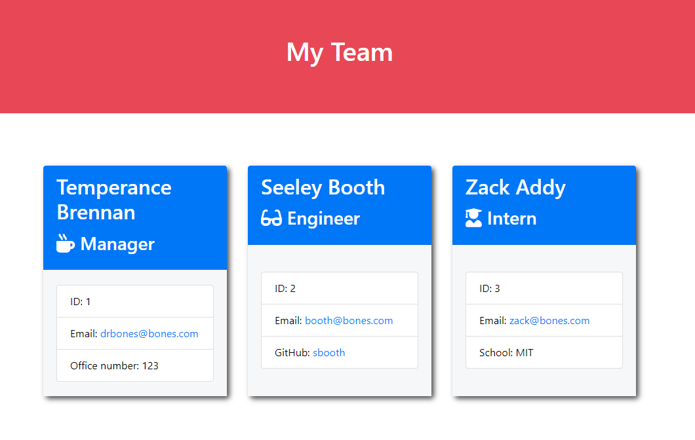

# Team Profile Generator

## Description

This is a node application that generates an html page containing the members of a team. The content is generated from user input.

[*Example Output*](./output/team.html)

## App Background

### User Story

**AS A** manager
**I WANT** to generate a webpage that displays my team's basic info
**SO THAT** I have quick access to their emails and GitHub profiles

### Acceptance Criteria

It is done when:

- A user starts the application and they are prompted to enter the manager's information

- A user is prompted to enter another employee's information (Engineer or Intern)

- A user chooses not to add any more employees, the html page is generated

- The generated page is saved to the output folder

## Visuals

